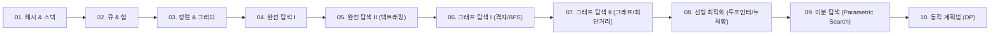

# 🚀 프로그래머스 알고리즘 단계별 마스터 로드맵

코딩테스트 빈출 알고리즘을 **기초 자료구조부터 심화 알고리즘까지 체계적인 개념 순서**로 정리한 단계별 로드맵입니다.  
주간 일정의 제약 없이 자신의 페이스에 맞춰 개념별로 순서대로 문제를 풀며 실전 해결 능력을 체화할 수 있도록 구성되었습니다.

---

## 📊 학습 진행 현황
- **총 문제 수**: 60문제
- **현재 진행률**: `6 / 60 완료 (10%)`
- **추천 학습 사이클**: **[개념 이해] → [Warm-up 기초] → [Lv.2 정형 템플릿 체화] → [Lv.2 심화/Lv.3 도전] → [백지 복기]**

---

## 📌 효율적인 문제 풀이 3대 원칙
1. **시간 복잡도 먼저 계산하기 ($N$의 크기 확인)**
   - $N \le 10$: $O(N!)$ 또는 $O(2^N)$ 백트래킹/완전탐색
   - $N \le 1,000$: $O(N^2)$ 이중 루프 가능
   - $N \le 100,000$: $O(N \log N)$ 정렬, 힙, 이분탐색 필수
   - $N \ge 1,000,000$: $O(N)$ 투 포인터, 슬라이딩 윈도우, 단조 스택, 또는 $O(\log N)$ 매개변수 탐색
2. **40분 타임어택 & 백지 복기**
   - 문제당 최대 40분 고민 후 풀리지 않으면 해설/힌트를 확인합니다.
   - 단, 해설 코드를 눈으로만 보지 않고 **창을 닫은 뒤 백지 상태에서 스스로 처음부터 끝까지 재구현**합니다.
3. **핵심 템플릿 체화**
   - 2차원 BFS 격자 탐색, 백트래킹 상태 복원, `PriorityQueue` 스케줄링, 이분 탐색(`left <= right`), DP 점화식 구성 패턴은 고민 없이 타이핑할 수 있도록 반복 숙달합니다.

---

## 📚 개념별 문제 풀이 로드맵

---

### Step 01. 해시(Hash) & 스택(Stack)
> **핵심 개념**: 중복 제거, 키-값 매핑 $O(1)$ 조회, LIFO(후입선출) 구조 및 단조 스택(Monotonic Stack) 최적화  
> **접근법**: 직전 상태와의 짝 맞추기, 최근 값과의 대소 비교, $O(N^2)$을 $O(N)$으로 줄여야 할 때 스택을 가장 먼저 떠올립니다.

| 순서 | 상태 | 문제명 | 난이도 | 핵심 유형 | 💡 어떻게 풀면 좋을까? (풀이 전략 & 팁) |
| :---: | :---: | :--- | :---: | :--- | :--- |
| **01** | [x] | [폰켓몬](https://school.programmers.co.kr/learn/courses/30/lessons/1845) | Lv.1 | 해시 셋 (HashSet) | `HashSet`에 번호를 넣어 중복을 제거한 뒤, 고유 종류 수와 `N/2` 중 최솟값을 구합니다. |
| **02** | [x] | [같은 숫자는 싫어](https://school.programmers.co.kr/learn/courses/30/lessons/12906) | Lv.1 | 스택 원리 / 연속 비교 | 배열을 순회하며 직전에 넣은 값(`stack.peek()`)과 현재 값이 다를 때만 저장합니다. |
| **03** | [x] | [올바른 괄호](https://school.programmers.co.kr/learn/courses/30/lessons/12909) | Lv.2 | 스택 기본 짝 맞추기 | `(`는 push, `)`는 pop. 비어있는데 pop하려 하거나 순회 후 스택이 남아있으면 올바르지 않은 괄호입니다. |
| **04** | [x] | [괄호 회전하기](https://school.programmers.co.kr/learn/courses/30/lessons/76502) | Lv.2 | 문자열 회전 + 다중 스택 | 길이 $N$만큼 회전시키며 `()`, `{}`, `[]` 세 쌍을 스택으로 유효성 검증합니다. Map으로 짝을 매핑하면 깔끔합니다. |
| **05** | [x] | [주식가격](https://school.programmers.co.kr/learn/courses/30/lessons/42584) | Lv.2 | 인덱스 스택 / 가격 유지 | 스택에 '값' 대신 '인덱스'를 저장합니다. 현재 가격이 떨어진 시점에 스택의 인덱스를 꺼내 유지 시간을 계산합니다. |
| **06** | [x] | [뒤에 있는 큰 수 찾기](https://school.programmers.co.kr/learn/courses/30/lessons/154539) | Lv.2 | 단조 스택 (Monotonic) | $N \le 10^6$이므로 $O(N^2)$은 시간 초과입니다. 내림차순을 유지하는 단조 스택에 인덱스를 넣고, 더 큰 수를 만나면 pop하며 정답을 채웁니다. |

---

### Step 02. 큐(Queue) & 힙(Heap) & 시뮬레이션
> **핵심 개념**: FIFO(선입선출) 대기열 시뮬레이션, 실시간 최솟값/최댓값을 $O(\log N)$에 다루는 우선순위 큐  
> **접근법**: 순서대로 대기열을 처리하거나(큐), 항상 '가장 작은/큰 값'을 반복해서 꺼내 갱신해야 할 때(우선순위 큐) 활용합니다.

| 순서 | 상태 | 문제명 | 난이도 | 핵심 유형 | 💡 어떻게 풀면 좋을까? (풀이 전략 & 팁) |
| :---: | :---: | :--- | :---: | :--- | :--- |
| **01** | [ ] | [카드 뭉치](https://school.programmers.co.kr/learn/courses/30/lessons/159994) | Lv.1 | 큐 / 투 포인터 | 카드 뭉치 두 개를 각각 Queue(또는 인덱스 포인터)로 두고, 목표 단어가 1번 또는 2번의 맨 앞과 일치하는지 순서대로 확인합니다. |
| **02** | [ ] | [기능개발](https://school.programmers.co.kr/learn/courses/30/lessons/42586) | Lv.2 | 큐 / 배포 일정 계산 | 각 작업 완료까지 걸리는 일수 `ceil((100 - progress) / speed)`를 계산한 후, 앞 작업 완료일보다 일찍 끝나는 뒤 작업들을 함께 묶어 배포합니다. |
| **03** | [ ] | [프로세스](https://school.programmers.co.kr/learn/courses/30/lessons/42587) | Lv.2 | 조건부 큐 회전 | `(인덱스, 우선순위)` 객체를 큐에 넣고, 현재 큐에서 우선순위가 더 높은 프로세스가 있다면 꺼내서 맨 뒤로 다시 넣는 과정을 시뮬레이션합니다. |
| **04** | [ ] | [더 맵게](https://school.programmers.co.kr/learn/courses/30/lessons/42626) | Lv.2 | 최소 힙 (`PriorityQueue`) | 가장 작은 두 음식을 꺼내 `가장 작은 값 + (두 번째 * 2)`로 섞어 다시 힙에 넣습니다. 맨 앞 원소가 $K$ 이상이 될 때까지 반복합니다. |
| **05** | [ ] | [다리를 지나는 트럭](https://school.programmers.co.kr/learn/courses/30/lessons/42583) | Lv.2 | 큐 기반 시간 시뮬레이션 | 다리 길이만큼의 Queue를 생성(트럭 없으면 0을 push)하여 1초마다 전진시키며 다리 위 총 무게를 추적합니다. |
| **06** | [ ] | [디스크 컨트롤러](https://school.programmers.co.kr/learn/courses/30/lessons/42627) | Lv.3 | 우선순위 큐 (SJF 스케줄링) | 현재 시점까지 요청된 작업들을 '소요 시간' 기준 최소 힙에 넣고 하나씩 처리하는 최단 작업 우선(Shortest Job First)을 구현합니다. |

---

### Step 03. 정렬(Sort) & 탐욕법(Greedy) & 복합 해시
> **핵심 개념**: 커스텀 Comparator 정렬 기준 수립, 복합 해시 카운팅, 매 순간 최적의 선택을 하는 그리디  
> **접근법**: 데이터를 특정 기준으로 재배열했을 때 최적의 해가 보장되는지(그리디 정당성) 증명하고 코드로 옮깁니다.

| 순서 | 상태 | 문제명 | 난이도 | 핵심 유형 | 💡 어떻게 풀면 좋을까? (풀이 전략 & 팁) |
| :---: | :---: | :--- | :---: | :--- | :--- |
| **01** | [ ] | [K번째수](https://school.programmers.co.kr/learn/courses/30/lessons/42748) | Lv.1 | 슬라이싱 & 정렬 | 배열의 $i$부터 $j$까지 자른 후 오름차순 정렬하여 $k$번째 원소를 추출하는 정렬 기초 연습입니다. |
| **02** | [ ] | [체육복](https://school.programmers.co.kr/learn/courses/30/lessons/42862) | Lv.1 | 그리디 / 정렬 | 여벌이 있는데 도난당한 학생을 먼저 상쇄(제외)한 뒤, 앞 번호 학생부터 인접한 번호(앞 $\to$ 뒤 순서)에게만 빌려주도록 처리합니다. |
| **03** | [ ] | [의상](https://school.programmers.co.kr/learn/courses/30/lessons/42578) | Lv.2 | 해시 맵 카운팅 & 경우의 수 | 의상 종류별 개수를 세어 `(개수 + 1)`(안 입는 경우 포함)을 모두 곱한 뒤, 아무것도 안 입는 경우 1가지를 뺍니다. |
| **04** | [ ] | [가장 큰 수](https://school.programmers.co.kr/learn/courses/30/lessons/42746) | Lv.2 | 커스텀 문자열 정렬 | 숫자를 문자로 바꾼 뒤 두 문자를 이어붙인 결과 `(b + a).compareTo(a + b)` 기준으로 내림차순 정렬합니다. 결과가 "0"으로 시작하는 예외를 처리합니다. |
| **05** | [ ] | [H-Index](https://school.programmers.co.kr/learn/courses/30/lessons/42747) | Lv.2 | 정렬 후 조건 판별 | 인용 횟수를 오름차순 정렬한 뒤, $i$번째 논문 인용 횟수가 남은 논문 편수($N - i$) 이상이 되는 첫 지점을 찾아 최댓값을 구합니다. |
| **06** | [ ] | [구명보트](https://school.programmers.co.kr/learn/courses/30/lessons/42885) | Lv.2 | 투 포인터 그리디 매칭 | 몸무게를 정렬한 후, 가장 가벼운 사람과 가장 무거운 사람을 짝지어 무게 제한을 넘는지 확인하며 양 끝에서 포인터를 좁혀갑니다. |

---

### Step 04. 완전 탐색 I (수학, 규칙성 & 시뮬레이션)
> **핵심 개념**: 단순 루프 전수조사, 규칙성 도출, 약수/수식 기반 탐색 범위 축소  
> **접근법**: 모든 경우를 다 확인해도 시간 안에 가능한지($N$의 범위 확인) 판별한 뒤, 수식이나 시뮬레이션으로 빠짐없이 탐색합니다.

| 순서 | 상태 | 문제명 | 난이도 | 핵심 유형 | 💡 어떻게 풀면 좋을까? (풀이 전략 & 팁) |
| :---: | :---: | :--- | :---: | :--- | :--- |
| **01** | [ ] | [모의고사](https://school.programmers.co.kr/learn/courses/30/lessons/42840) | Lv.1 | 모듈러 연산 반복 패턴 | 1, 2, 3번 수포자의 찍기 패턴 배열을 선언하고, 문제 인덱스를 패턴 길이로 나눈 나머지(`i % pattern.length`)로 정답을 대조합니다. |
| **02** | [ ] | [최소직사각형](https://school.programmers.co.kr/learn/courses/30/lessons/86491) | Lv.1 | 관점 전환 탐색 | 명함을 회전할 수 있으므로 각 명함마다 `max(w, h)`를 한쪽으로, `min(w, h)`를 다른 쪽으로 모은 뒤 각각의 최댓값을 곱합니다. |
| **03** | [ ] | [카펫](https://school.programmers.co.kr/learn/courses/30/lessons/42842) | Lv.2 | 약수 탐색 & 기하 수식 | 전체 격자 수(`brown + yellow`)의 약수 쌍(가로 $\ge$ 세로 $\ge 3$)을 구하여 `(가로 - 2) * (세로 - 2) == yellow`를 만족하는지 검사합니다. |
| **04** | [ ] | [점 찍기](https://school.programmers.co.kr/learn/courses/30/lessons/140107) | Lv.2 | 피타고라스 수식 $O(N)$ 탐색 | $x$ 좌표를 $0$부터 $d$까지 $k$씩 증가시키며, 원의 방정식 $y = \lfloor\sqrt{d^2 - x^2}\rfloor$로 가능한 $y$의 개수 `(y / k) + 1`을 빠르게 누적합니다. |
| **05** | [ ] | [롤케이크 자르기](https://school.programmers.co.kr/learn/courses/30/lessons/132265) | Lv.2 | Map/Set 경계 이동 탐색 | 형은 Set으로 토핑 종류를 늘려가고, 동생은 미리 계산해둔 토핑 카운트 Map에서 하나씩 줄여가며 두 사람의 토핑 종류 수가 같아지는 순간을 셉니다. |
| **06** | [ ] | [전력망을 둘로 나누기](https://school.programmers.co.kr/learn/courses/30/lessons/86971) | Lv.2 | 전선 절단 완전탐색 | 전선(간선)이 최대 100개이므로, 전선을 하나씩 끊어보고 남은 트리 한쪽의 노드 수를 BFS/DFS로 세어 두 전력망 크기 차이의 최솟값을 갱신합니다. |

---

### Step 05. 완전 탐색 II (재귀 & 백트래킹)
> **핵심 개념**: 상태 공간 트리 순회, 재귀 호출, 방문 복원(`visited = false`), 불필요한 경로 가지치기(Pruning)  
> **접근법**: "모든 순열/조합을 만들거나 조건에 맞는 배치를 찾아야 할 때", 재귀 함수와 방문 배열을 활용하여 상태를 탐색하고 되돌립니다.

| 순서 | 상태 | 문제명 | 난이도 | 핵심 유형 | 💡 어떻게 풀면 좋을까? (풀이 전략 & 팁) |
| :---: | :---: | :--- | :---: | :--- | :--- |
| **01** | [ ] | [삼총사](https://school.programmers.co.kr/learn/courses/30/lessons/131705) | Lv.1 | 조합 ($_{N}C_3$) 기초 | 3중 for문 또는 3개 원소를 고르는 재귀 조합 함수를 작성하여 세 숫자의 합이 0이 되는 조합의 수를 구합니다. |
| **02** | [ ] | [피로도](https://school.programmers.co.kr/learn/courses/30/lessons/87946) | Lv.2 | 순열 백트래킹 템플릿 | 던전 수가 최대 8개이므로 모든 방문 순서(순열)를 DFS 백트래킹으로 탐색합니다. `visited[i] = true` $\to$ 재귀 $\to$ `visited[i] = false` 복원이 핵심입니다. |
| **03** | [ ] | [소수 찾기](https://school.programmers.co.kr/learn/courses/30/lessons/42839) | Lv.2 | 순열 생성 + 소수 판별 | 주어진 숫자 카드로 만들 수 있는 모든 길이의 숫자를 백트래킹으로 만들어 Set에 모은 뒤, 에라토스테네스의 체나 $\sqrt{N}$ 소수 판별법을 적용합니다. |
| **04** | [ ] | [모음 사전](https://school.programmers.co.kr/learn/courses/30/lessons/84512) | Lv.2 | 중복 순열 DFS | A, E, I, O, U로 만들 수 있는 길이 5 이하의 단어를 사전순으로 재귀 생성하며 순번을 카운트하거나, 자리수별 가중치 수식으로 계산합니다. |
| **05** | [ ] | [쿼드압축 후 개수 세기](https://school.programmers.co.kr/learn/courses/30/lessons/68936) | Lv.2 | 4분할 분할 정복 | 현재 영역의 모든 수가 같은지 확인하고, 같지 않다면 가로/세로를 절반으로 나눈 4개의 하위 사각형으로 재귀 분할하여 압축합니다. |
| **06** | [ ] | [N-Queen](https://school.programmers.co.kr/learn/courses/30/lessons/12952) | Lv.2 | 정석 백트래킹 (가지치기) | 행 단위로 퀸을 놓아가며 열과 양쪽 대각선에 기존 퀸이 있는지 확인합니다. 놓을 수 없는 위치라면 즉시 다음 탐색을 중단하고 가지치기합니다. |

---

### Step 06. 그래프 탐색 I (DFS/BFS & 2차원 격자 탐색)
> **핵심 개념**: 2차원 배열 상하좌우 탐색(`dx/dy`), 큐를 이용한 최단 경로(BFS), 독립된 연결 요소(Connected Component) 탐색  
> **접근법**: 최단 거리는 반드시 BFS(가장 먼저 도달한 경로가 최단), 단순 연결 구역 탐색이나 모든 경로 확인은 DFS/BFS 모두 가능합니다.

| 순서 | 상태 | 문제명 | 난이도 | 핵심 유형 | 💡 어떻게 풀면 좋을까? (풀이 전략 & 팁) |
| :---: | :---: | :--- | :---: | :--- | :--- |
| **01** | [ ] | [음양 더하기](https://school.programmers.co.kr/learn/courses/30/lessons/76501) | Lv.1 | 조건 순회 웜업 | 불리언 부호 배열에 따라 더하거나 빼는 기본 탐색 웜업 문제입니다. |
| **02** | [ ] | [타겟 넘버](https://school.programmers.co.kr/learn/courses/30/lessons/43165) | Lv.2 | 2분기 재귀 DFS | 각 숫자마다 `+`를 붙이는 경우와 `-`를 붙이는 2가지 분기로 깊이 $N$까지 재귀 호출하여 합이 타겟 넘버와 일치하는 경우의 수를 셉니다. |
| **03** | [ ] | [게임 맵 최단거리](https://school.programmers.co.kr/learn/courses/30/lessons/1844) | Lv.2 | 격자 최단거리 BFS 정석 | 상하좌우 `dx/dy` 이동 큐를 구성하고, 큐에 넣는 즉시 방문 처리(`dist[nx][ny] = dist[x][y] + 1`)하여 목적지 최단 거리를 구합니다. |
| **04** | [ ] | [무인도 여행](https://school.programmers.co.kr/learn/courses/30/lessons/154540) | Lv.2 | 격자 연결 요소 합산 | 숫자가 적힌 칸을 만날 때마다 BFS/DFS로 연결된 섬 전체의 식량을 합산하여 리스트에 담은 후 오름차순 정렬합니다. |
| **05** | [ ] | [미로 탈출](https://school.programmers.co.kr/learn/courses/30/lessons/159993) | Lv.2 | 2단계 최단거리 BFS | 레버를 당겨야 출구가 열리므로, `시작점 -> 레버` 최단거리 BFS와 `레버 -> 출구` 최단거리 BFS를 각각 수행하여 두 거리의 합을 구합니다. |
| **06** | [ ] | [리코쳇 로봇](https://school.programmers.co.kr/learn/courses/30/lessons/169199) | Lv.2 | 미끄러짐 조건 BFS | 한 칸씩 이동하는 것이 아니라 벽이나 장애물에 부딪힐 때까지 `while`문으로 미끄러져 멈추는 위치를 다음 좌표로 삼아 BFS를 수행합니다. |

---

### Step 07. 그래프 탐색 II (연결 그래프, 최단 경로 & 상태 전이)
> **핵심 개념**: 인접 행렬/인접 리스트 그래프 표현, 다익스트라(Dijkstra) 최단 경로, 단어/상태 전이 그래프 모델링  
> **접근법**: 문제가 '격자'가 아닌 노드와 간선으로 주어지거나, 문제를 그래프 상태 전이 형태로 모델링하여 해결합니다.

| 순서 | 상태 | 문제명 | 난이도 | 핵심 유형 | 💡 어떻게 풀면 좋을까? (풀이 전략 & 팁) |
| :---: | :---: | :--- | :---: | :--- | :--- |
| **01** | [ ] | [콜라츠 추측](https://school.programmers.co.kr/learn/courses/30/lessons/12943) | Lv.1 | 단순 상태 전이 | 조건에 맞춰 숫자를 변환하며 1이 되는 단계를 셉니다. 연산 중 정수 오버플로우 방지를 위해 `long`으로 변환합니다. |
| **02** | [ ] | [배달](https://school.programmers.co.kr/learn/courses/30/lessons/12978) | Lv.2 | 다익스트라 (Dijkstra) | 간선에 가중치가 있으므로 1번 마을부터 우선순위 큐 기반 다익스트라 최단 경로 알고리즘을 적용하여 최단 시간 $\le K$인 마을 수를 셉니다. |
| **03** | [ ] | [네트워크](https://school.programmers.co.kr/learn/courses/30/lessons/43162) | Lv.3 | 인접 행렬 컴포넌트 개수 | 인접 행렬로 주어진 컴퓨터 연결 정보에서 미방문 노드를 시작점으로 DFS를 돌려 총 연결 요소(독립된 네트워크)의 개수를 구합니다. |
| **04** | [ ] | [단어 변환](https://school.programmers.co.kr/learn/courses/30/lessons/43163) | Lv.3 | 상태 전이 BFS | 단어들을 노드로 보고, 알파벳이 정확히 1글자만 다른 단어들 사이에 간선이 있다고 간주하여 BFS로 `begin -> target` 최소 변환 횟수를 찾습니다. |
| **05** | [ ] | [가장 먼 노드](https://school.programmers.co.kr/learn/courses/30/lessons/49189) | Lv.3 | 인접 리스트 BFS 최단 거리 | 인접 리스트 양방향 그래프를 구성하고 1번 노드에서 BFS를 수행하여 각 노드의 최단 거리를 기록한 뒤 최댓값을 갖는 노드 개수를 셉니다. |
| **06** | [ ] | [여행경로](https://school.programmers.co.kr/learn/courses/30/lessons/43164) | Lv.3 | 오일러 경로 백트래킹 | 모든 항공권을 소비하는 경로를 찾아야 합니다. 알파벳 순서가 빠른 경로를 먼저 완성하기 위해 티켓을 정렬해두고 DFS 백트래킹을 수행합니다. |

---

### Step 08. 선형 탐색 최적화 (투 포인터, 슬라이딩 윈도우, 누적합)
> **핵심 개념**: 정렬 배열/연속 부분 수열 양 끝 포인터 제어, 고정/가변 크기 윈도우 이동, 구간 합(Prefix Sum) $O(1)$ 조회  
> **접근법**: $O(N^2)$ 구간 탐색을 포인터의 단조성을 이용해 $O(N)$으로 최적화합니다.

| 순서 | 상태 | 문제명 | 난이도 | 핵심 유형 | 💡 어떻게 풀면 좋을까? (풀이 전략 & 팁) |
| :---: | :---: | :--- | :---: | :--- | :--- |
| **01** | [ ] | [예산](https://school.programmers.co.kr/learn/courses/30/lessons/12982) | Lv.1 | 정렬 & 누적합 그리디 | 신청 금액을 오름차순 정렬한 뒤 가장 작은 금액부터 누적합을 구해 예산 내에서 최대로 지원 가능한 부서 수를 구합니다. |
| **02** | [ ] | [숫자의 표현](https://school.programmers.co.kr/learn/courses/30/lessons/12924) | Lv.2 | 연속 구간합 투 포인터 | `left`, `right` 두 포인터를 1부터 증가시키며 구간합이 $N$보다 작으면 `right++`, 크면 `left++`, 같으면 카운트 증가시키는 방식으로 $O(N)$ 해결합니다. |
| **03** | [ ] | [연속된 부분 수열의 합](https://school.programmers.co.kr/learn/courses/30/lessons/178870) | Lv.2 | 투 포인터 정석 | 비내림차순 수열에서 구간합이 $k$인 범위를 투 포인터로 찾고, 길이가 가장 짧고 시작 인덱스가 작은 구간으로 최적해를 갱신합니다. |
| **04** | [ ] | [할인 행사](https://school.programmers.co.kr/learn/courses/30/lessons/131127) | Lv.2 | 고정 슬라이딩 윈도우 | 10일 크기의 윈도우를 한 칸씩 오른쪽으로 밀면서 빠지는 항목 카운트 -1, 새로 들어오는 항목 카운트 +1을 적용하여 원하는 품목 조건과 대조합니다. |
| **05** | [ ] | [호텔 대실](https://school.programmers.co.kr/learn/courses/30/lessons/155651) | Lv.2 | 누적합 / 우선순위 큐 | 입실 시각 순으로 정렬 후 종료 시각(+10분 청소)을 우선순위 큐로 관리하거나, 분 단위(0~1440분) 차분 배열(Imos법)로 겹치는 최대 객실 수를 구합니다. |
| **06** | [ ] | [보석 쇼핑](https://school.programmers.co.kr/learn/courses/30/lessons/67258) | Lv.3 | 가변 슬라이딩 윈도우 + Map | `right`를 늘려 모든 보석 종류를 포함시킨 후, 모든 종류가 유지되는 한도 내에서 `left`를 당겨 구간 길이를 최소화하는 투 포인터를 적용합니다. |

---

### Step 09. 이분 탐색 (Binary Search) & 매개변수 탐색 (Parametric Search)
> **핵심 개념**: 정렬된 배열의 $O(\log N)$ 값 탐색, 최적화 문제를 결정 문제(Yes/No)로 바꾸는 매개변수 탐색  
> **접근법**: 탐색 대상의 범위가 매우 크고($10^9$ 이상) 답의 조건이 단조성(Monotonicity)을 띨 때, '답' 자체를 이분 탐색의 범위로 설정합니다.

| 순서 | 상태 | 문제명 | 난이도 | 핵심 유형 | 💡 어떻게 풀면 좋을까? (풀이 전략 & 팁) |
| :---: | :---: | :--- | :---: | :--- | :--- |
| **01** | [ ] | [부족한 금액 계산하기](https://school.programmers.co.kr/learn/courses/30/lessons/82612) | Lv.1 | 수열의 합 & 범위 감각 | $1$부터 $count$까지의 총 필요 금액을 등차수열 공식 $price \times count \times (count+1) / 2$로 계산합니다. 오버플로우 방지를 위해 `long`을 사용합니다. |
| **02** | [ ] | [이진 변환 반복하기](https://school.programmers.co.kr/learn/courses/30/lessons/70129) | Lv.2 | 2진수 변환 시뮬레이션 | 0의 개수를 세어 제거하고 남은 길이를 `Integer.toBinaryString()`으로 변환하는 과정을 "1"이 될 때까지 반복하며 변환 횟수와 제거된 0을 누적합니다. |
| **03** | [ ] | [입국심사](https://school.programmers.co.kr/learn/courses/30/lessons/43238) | Lv.3 | 매개변수 탐색 대표 문제 | "모든 사람이 심사받는 데 걸리는 시간 $T$"를 이분 탐색 범위로 잡고, "$T$ 시간 동안 심사관들이 총 $n$명 이상 처리 가능한가?"를 검사하여 최솟값을 찾습니다. |
| **04** | [ ] | [순위 검색](https://school.programmers.co.kr/learn/courses/30/lessons/72412) | Lv.2 | 해시 맵 + `lower_bound` | 지원자의 조건으로 가능한 16가지 쿼리 키에 점수 리스트를 매핑한 뒤, 점수 리스트를 정렬해두고 이분 탐색(`lower_bound`)으로 기준 점수 이상 인원을 $O(\log N)$에 찾습니다. |
| **05** | [ ] | [징검다리 건너기](https://school.programmers.co.kr/learn/courses/30/lessons/64062) | Lv.3 | 건널 수 있는 인원 이분 탐색 | "건널 수 있는 인원 수 $M$"을 이분 탐색합니다. $M$명이 건넜을 때 0 이하로 떨어진 연속 디딤돌의 개수가 $k$개 이상인지 검사하여 가능 여부를 판별합니다. |
| **06** | [ ] | [징검다리](https://school.programmers.co.kr/learn/courses/30/lessons/43236) | Lv.4 | 거리 최솟값의 최대화 | "바위 사이의 최소 거리 $D$"를 이분 탐색합니다. 바위 사이 거리가 $D$ 미만이면 바위를 제거하고, 제거된 바위 수가 $n$ 이하인지 확인하며 최대 거리를 갱신합니다. |

---

### Step 10. 동적 계획법 (Dynamic Programming, DP)
> **핵심 개념**: 큰 문제를 중복되는 부분 문제로 분할, 점화식 도출, 메모이제이션(Memoization) / 바텀업(Bottom-up) 테이블 채우기  
> **접근법**: 이전 단계의 최적해가 다음 단계 최적해의 부분 문제가 되는지 확인하고, 점화식 $DP[i]$ 또는 $DP[i][j]$의 상태 정의를 세웁니다.

| 순서 | 상태 | 문제명 | 난이도 | 핵심 유형 | 💡 어떻게 풀면 좋을까? (풀이 전략 & 팁) |
| :---: | :---: | :--- | :---: | :--- | :--- |
| **01** | [ ] | [피보나치 수](https://school.programmers.co.kr/learn/courses/30/lessons/12945) | Lv.2 | 1차원 바텀업 DP 기초 | $F(n) = (F(n-1) + F(n-2)) \pmod{1234567}$. 매 연산마다 모듈러 연산을 적용하며 1차원 배열이나 두 변수로 $O(N)$에 해결합니다. |
| **02** | [ ] | [2 x n 타일링](https://school.programmers.co.kr/learn/courses/30/lessons/12900) | Lv.2 | 타일 채우기 점화식 | 가로 길이 $n$을 채우는 방법은 $n-1$에서 세로 타일 1개를 붙이거나 $n-2$에서 가로 타일 2개를 붙이는 것이므로, $DP[i] = DP[i-1] + DP[i-2]$를 적용합니다. |
| **03** | [ ] | [땅따먹기](https://school.programmers.co.kr/learn/courses/30/lessons/12913) | Lv.2 | 2차원 열 배타 조건 DP | $i$번째 행의 각 열에 대해, 직전 $i-1$행에서 같은 열을 제외한 3개 열의 최댓값을 더해 누적 갱신하며 내려간 후 마지막 행의 최댓값을 취합니다. |
| **04** | [ ] | [정수 삼각형](https://school.programmers.co.kr/learn/courses/30/lessons/43105) | Lv.3 | 2차원 삼각형 누적합 DP | 삼각형 위에서 아래로 내려오며 왼쪽 대각선 위와 오른쪽 대각선 위에서 올 수 있는 최댓값을 더해 갱신합니다. |
| **05** | [ ] | [등굣길](https://school.programmers.co.kr/learn/courses/30/lessons/42898) | Lv.3 | 장애물 격자 경로 수 DP | 오른쪽과 아래쪽으로만 이동 가능하므로 $DP[y][x] = (DP[y-1][x] + DP[y][x-1]) \pmod{10^9+7}$. 물에 잠긴 지역은 0으로 처리합니다. |
| **06** | [ ] | [N으로 표현](https://school.programmers.co.kr/learn/courses/30/lessons/42895) | Lv.3 | 집합 결합 (Set DP) | $N$을 $k$번 사용해 만들 수 있는 수들의 집합을 $S[k]$라 할 때, $S[k] = \bigcup (S[i] \text{ [사칙연산] } S[k-i])$로 $1 \le k \le 8$까지 확장하며 target을 찾습니다. |

---

## 💡 오답 노트 & 복습 템플릿 권장 사항
문제를 푼 후에는 단순히 정답 코드를 저장하는 것에 그치지 않고, 아래 4가지 항목을 간단히 정리하는 것을 추천합니다:
1. **사용한 알고리즘/자료구조 & 선택 이유**
2. **시간 복잡도 & 공간 복잡도 ($O$ 표기법)**
3. **핵심 로직 & 엣지 케이스 (경계값, $0$, 빈 배열 등)**
4. **풀면서 겪은 시행착오 또는 다른 사람의 모범 풀이에서 배운 점**